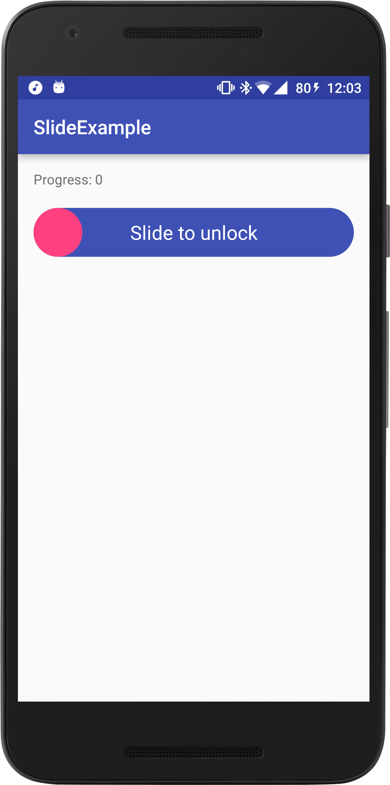

# Slide Button

[](https://jitpack.io/#jchernandez/SlideButton)
## What is a SlideButton?

SlideButton is a button that needs a swipe-gesture to confirm an action. Just like a `Slide to unlock`.

<div align="center">
  
</div>

## Usage
Simply add the View to your layout:
```xml
<com.rojoxpress.slidebutton.SlideButton
    android:layout_width="match_parent"
    android:layout_height="60dp"
    android:background="@drawable/back_slide_button"
    app:thumb="@drawable/seekbar_thumb"
    app:text="@string/slide_to_pay"
    android:id="@+id/slide_button"/>
```

It can be created from `Java`:
```java
SlideButton slideButton = new SlideButton(getContext());
slideButton.setThumb(ContextCompat.getDrawable(getContext(),R.drawable.slider_thumb));
slideButton.setText("Slide to unlock");
slideButton.setBackgroundResource(R.drawable.back_slide_button);
```

#### Listeners

Create a `SlideButtonListener` to callback when the user has finish the Slide gesture.

```java
SlideButton slideButton = new SlideButton(getContext());
slideButton.setSlideButtonListener(new SlideButton.SlideButtonListener() {
    @Override
    public void onSlide() {
        Toast.makeText(getContext(),"Unlocked",Toast.LENGTH_SHORT).show();
    }
});
```

Create a `OnSlideChangeListener` to callback on slide change.

```java
slideButton.setOnSlideChangeListener(new SlideButton.OnSlideChangeListener() {
    @Override
    public void onSlideChange(float position) {
        textView.setText("Progress: "+position);
    }
});
```

# Gradle Dependency

### Repository
The Gradle dependency is available via [JitPack](https://jitpack.io/#jchernandez/SlideButton).

Add it in your root build.gradle at the end of repositories:
```gradle
allprojects {
	repositories {
		...
		maven { url "https://jitpack.io" }
	}
}
```

 Add the dependency:
```gradle
dependencies {
    compile 'com.github.jchernandez:SlideButton:0.1'
}
```
